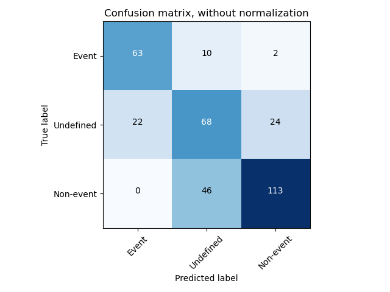
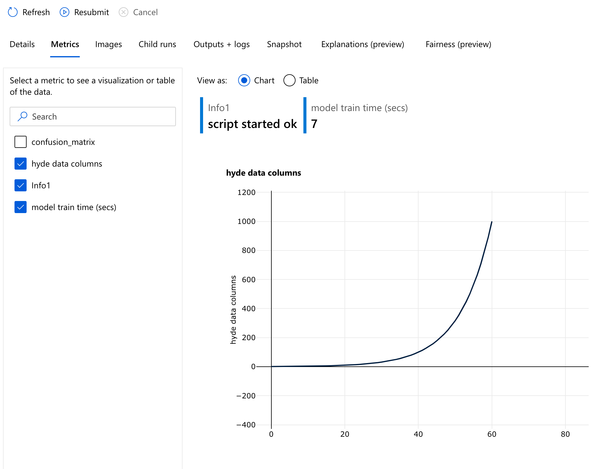

# Testing AzureML tools with a particle data classifier

AzureML offers a lot of tools for MLOps. Here I test some of them with Python azureml-sdk. All this requires that I have a Azure subscription with Machine Learning workspace service. There I can also control all my component, such as Datasets, Compute targets, Environments, Models, Pipelines, Endpoints. 

The ML model is a toy model I often use. It is a supervised problem where the aim is to classify daily particle size distributions (I analyzed that data a lot when I did my PhD, so know and like the problem). In short, there are days when something happens (event days), days when something does not happen (non-event days) and mixed days (undefined days). Here we were try to build a model to predict days into these three groups. 

We have particle concentration data (10 min resolution time-series, 32 channel data, channels of particle diameter between 3-1000 nm) and classification data (daily value for event, non-event or undefined). Both have mixed quality, some data is missing and some data wrong. The classification data is actually also provided with higher granularity than described above: there is class 1a, 1b, and 2 events. Here we however aggregate them all to one group. Data is from https://avaa.tdata.fi/web/smart/smear

The repository contains 3 notebooks

1. `notebooks/01_Create_aerosol_dataset.ipynb`

Reads data from Azure Blob storage and registers datasets into Azure ML workspace

2. `notebooks/02_Scripts_to_train_model.ipynb`

Contains a model training script. The script is used in the next notebook when model is trained.

The training script uses Tensorflow with Keras to build up a CNN classifier. The classifier is simple and bad, but it is fast to run. :) 

Dataset samples, data from training process, and the test data confusion matrix are saved in Azure Machine Learning workspace to keep track on the performance of the model. 

3. `notebooks/03_Create_experiment.ipynb`

This notebook tests different MLOps blocks to use when training a ML model. 

- Set up different alternative compute targets
- Set up a defined training environment
- Use registered datasets to have registered data versions
- Create Experiment that collects and documents all the above, so the model training can be repeated
- Register model -> get versions for the models

## The results

The resulting ML model is bad, but we are more interested in testing the AzureML MLOps tools. 

This is the saved confusion matrix. 

Here is a screeshots of the Azure ML workspace panel what can be used to monitor the runs. 

